### 智能DNS管理平台
> python 3.6.5

### Build Setup
``` bash
    pip install -r requirments
    python3 manage.py migrate --settings=settings.dev  # 创建表结构
    python3 manage.py makemigrations  --settings=settings.dev # 注册模型变更
```

### Features

- [x] 服务器管理
    - [x] 服务器新增、删除
    - [x] DNS服务部署
- [x] Bind服务配置
    - [x] 区域和线路的配置
    - [x] 域名管理
    - [x] 记录管理
- [x] Bind配置管理
    - [x] 配置生成和同步
    - [x] 配置回滚
- [x] 登录权限
    - [x] SSO登录
    - [x] 内置用户Token验证 
- [x]  DNS解析量看板
    - [x] 首页展示解析用量表
    - [x] 域名级别的用量统计结合Prometheus做成业务量看板

如果你有好的建议或者 idea 💡、请联系我 🤩

### Preview

* 首页-查询展示域名解析量
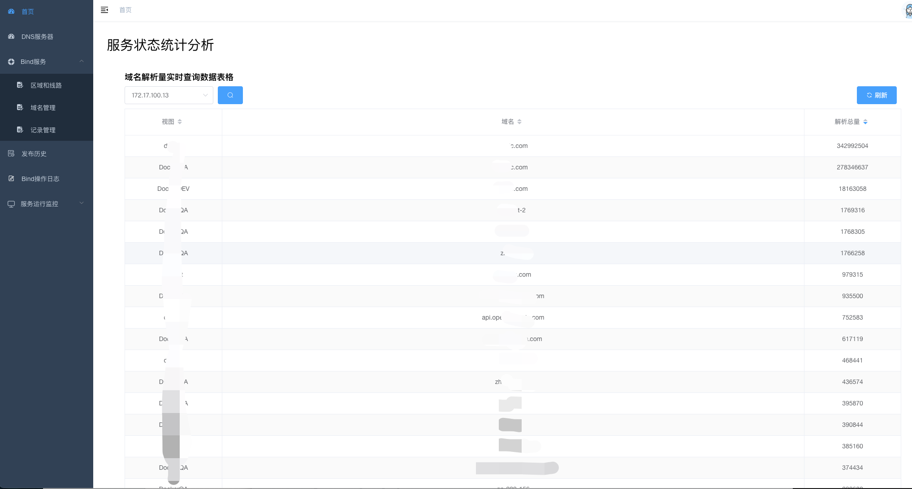

* 服务器展示页.png
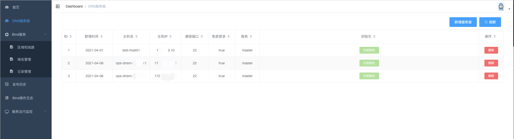

* 服务器添加页.png
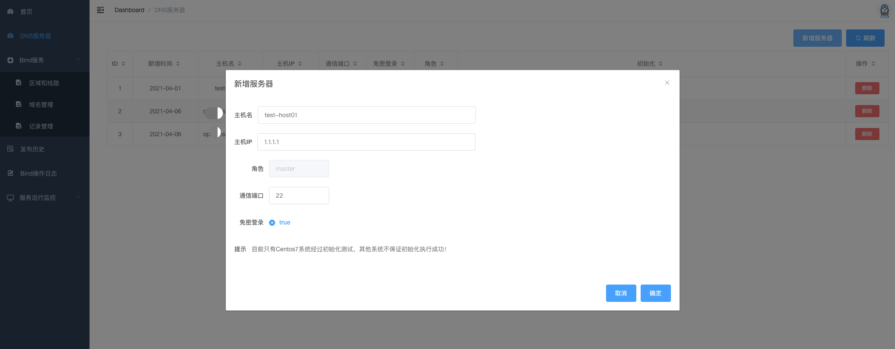

* 区域和线路展示页.png
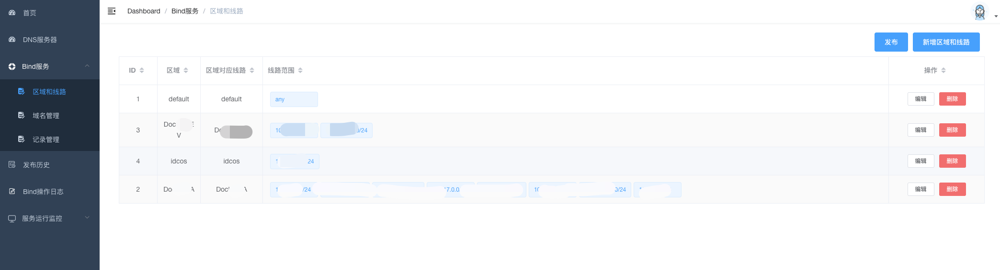

* 区域和线路展示页
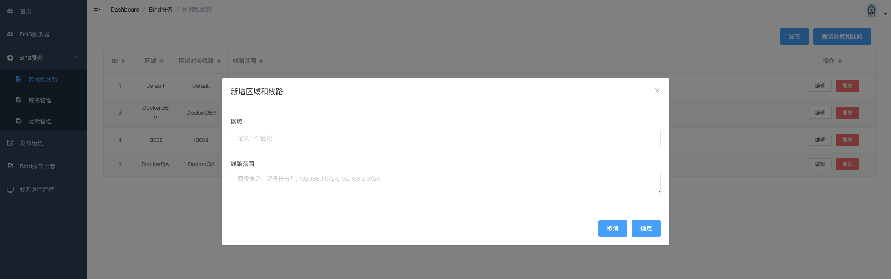

* 域名管理展示页
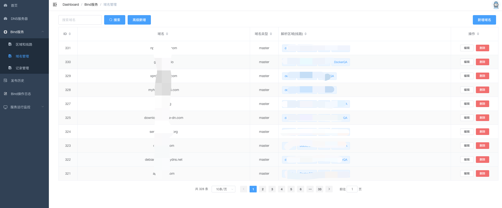

* 域名管理新增页
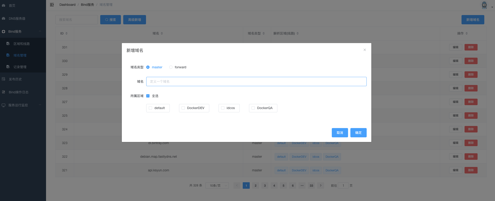

* 域名管理高级新增
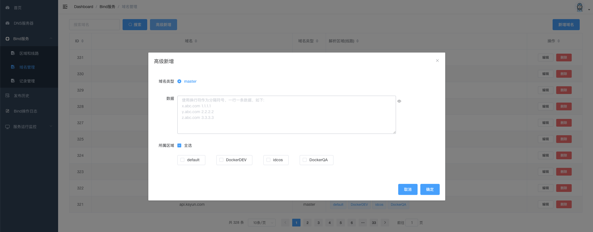

* 域名记录展示页
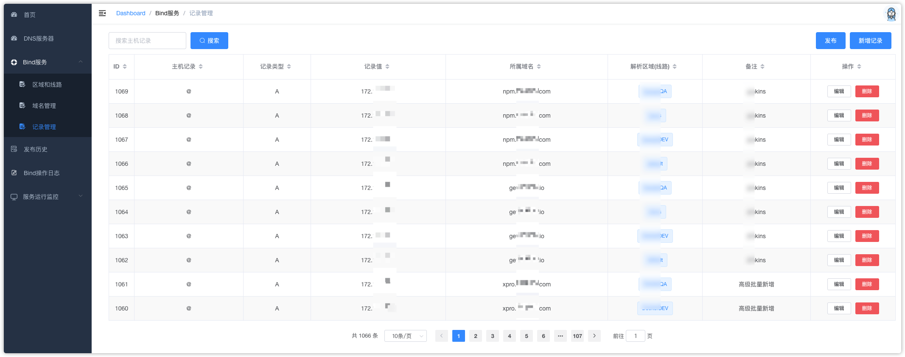

* 域名记录新增页


* 配置发布按钮入口
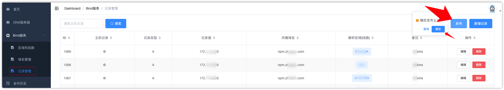
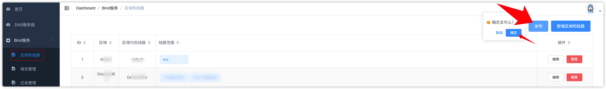

* 配置发布历史记录
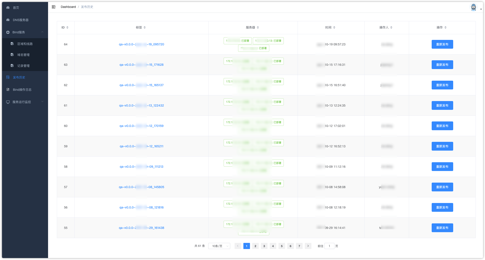

* 操作审计
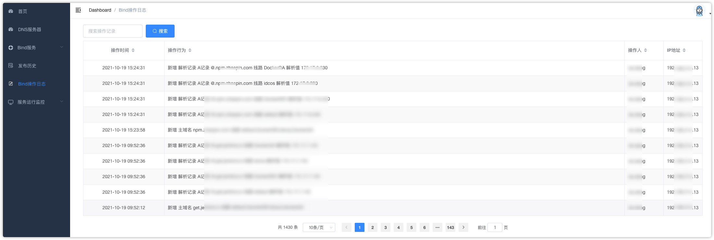

* 服务数据监控看板
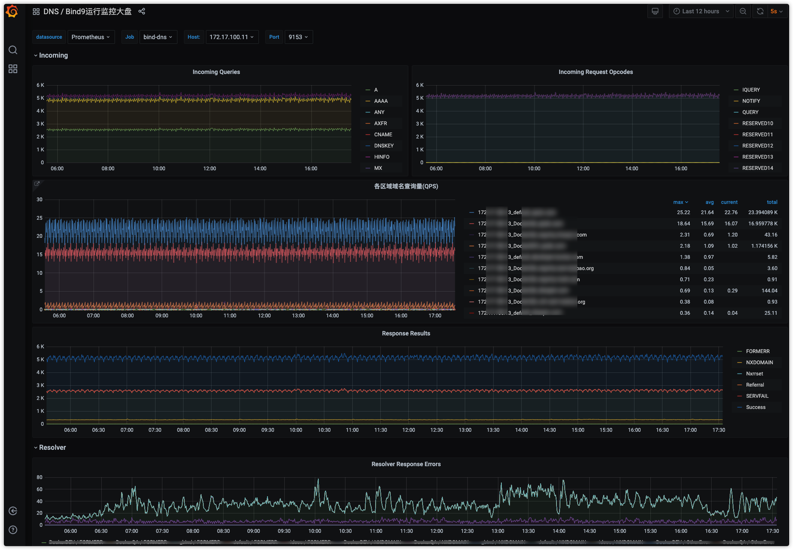
