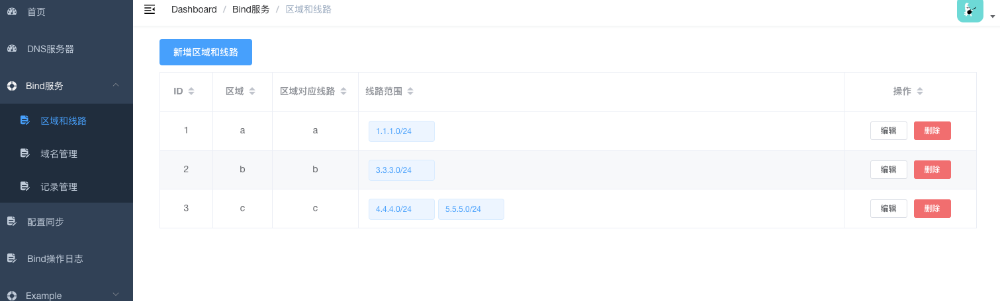
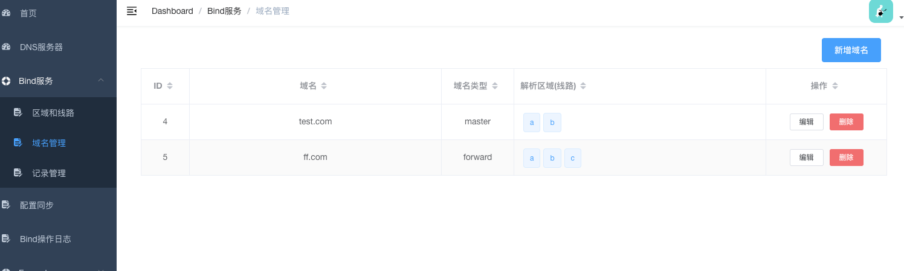
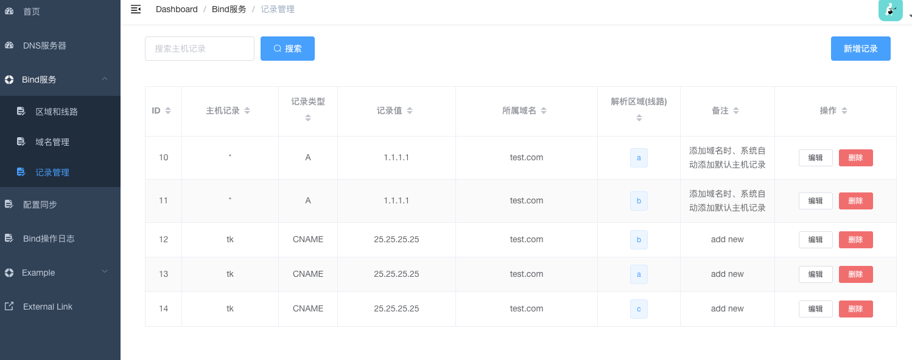
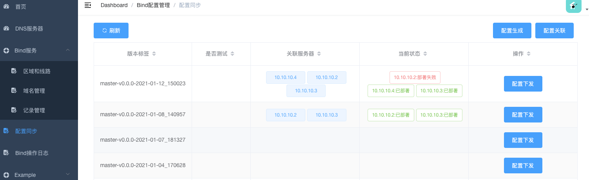
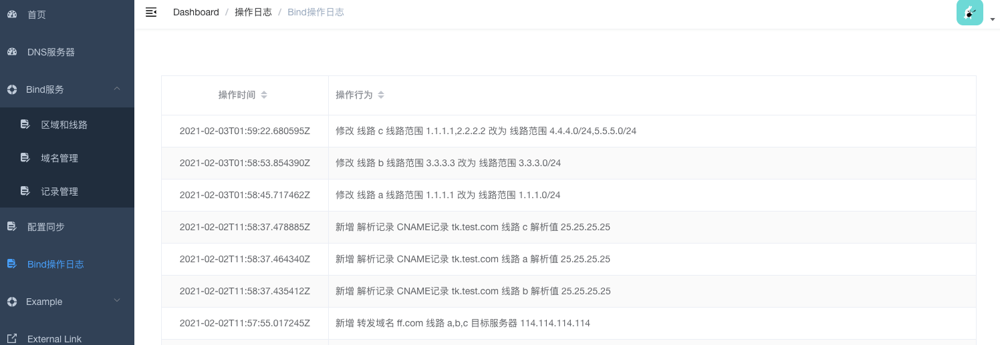

### 智能DNS管理平台
> python 3.6.5
          
### Build Setup
``` bash
    pip install -r requirments
    python3 manage.py migrate --settings=settings.dev  # 创建表结构
    python3 manage.py makemigrations  --settings=settings.dev # 注册模型变更
```

### Preview












### Features

- [x] 服务器管理
    - [x] 服务器新增、删除
    - [x] DNS服务部署
- [x] Bind服务配置
    - [x] 区域和线路的配置
    - [x] 域名管理
    - [x] 记录管理
- [x] Bind配置管理
    - [x] 配置生成和同步
    - [x] 配置回滚
- [x] 登录权限
    - [x] SSO登录
- [ ] DNS解析量看板

